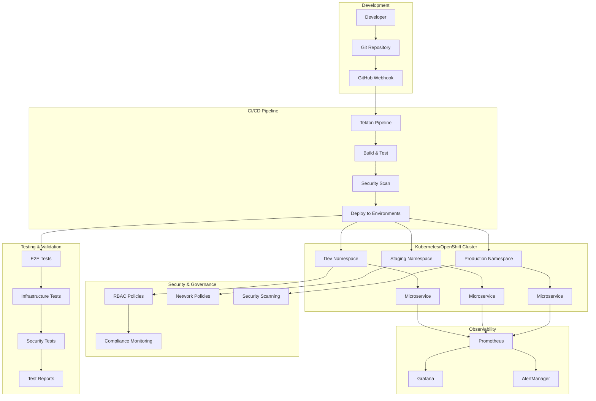

# 🚀 DevOps Pipeline - Complete Implementation

[](https://kubernetes.io/)
[](https://www.openshift.com/)
[](https://python.org/)
[](https://fastapi.tiangolo.com/)
[](https://docker.com/)
[](https://tekton.dev/)
[](https://prometheus.io/)
[](https://grafana.com/)

A production-ready, enterprise-grade DevOps pipeline implementation featuring cloud-native microservices, automated CI/CD, comprehensive monitoring, security governance, and complete testing validation.

## 🎯 Project Overview

This project demonstrates a complete end-to-end DevOps implementation following industry best practices and enterprise standards. Built for **OpenShift/Kubernetes** environments, it showcases the entire software delivery lifecycle from development to production deployment with full automation, monitoring, and governance.

### 🏗️ Architecture Overview



### 🎯 Key Features

#### 🔧 **Core Infrastructure**
- **Cloud-Native Microservice**: FastAPI-based RESTful service with health checks
- **Multi-Stage Docker Build**: Secure, optimized container images
- **Multi-Environment Support**: Dev, Staging, Production namespaces
- **Kustomize Configuration**: Environment-specific deployments

#### 🚀 **CI/CD Automation**
- **Tekton Pipelines**: Cloud-native CI/CD with OpenShift integration
- **GitHub Integration**: Webhook-triggered automated deployments
- **Security Scanning**: Trivy, Hadolint, OWASP dependency checks
- **Approval Gates**: Manual approval for production deployments

#### 📊 **Observability Stack**
- **Prometheus Monitoring**: Comprehensive metrics collection
- **Grafana Dashboards**: Real-time visualization and alerting
- **Loki Logging**: Centralized log aggregation
- **AlertManager**: Intelligent alert routing and notifications

#### 🛡️ **Security & Governance**
- **RBAC Implementation**: Role-based access control with 7 distinct roles
- **Network Policies**: Zero-trust network security
- **Pod Security Standards**: Enforced security contexts
- **Resource Management**: Quotas, limits, and governance policies

#### 🧪 **Testing Framework**
- **End-to-End Testing**: Comprehensive API and functionality validation
- **Infrastructure Testing**: Cluster health and configuration validation
- **Security Testing**: Compliance and vulnerability assessment
- **Performance Testing**: Load testing and response time validation

## 📁 Project Structure

```
stajdevopsproje/
├── app/                          # Microservice source code
│   ├── main.py                   # FastAPI application
│   ├── config.py                 # Configuration management
│   ├── models.py                 # Pydantic models
│   ├── requirements.txt          # Python dependencies
│   └── tests/                    # Unit and integration tests
├── build/                        # Build and containerization
│   ├── Dockerfile                # Multi-stage Docker build
│   ├── scripts/                  # Build automation scripts
│   └── docker-compose.yml        # Local development environment
├── cicd/                         # CI/CD pipeline definitions
│   ├── tekton/                   # Tekton pipeline resources
│   ├── jenkins/                  # Jenkins fallback pipeline
│   └── scripts/                  # Pipeline setup and utilities
├── openshift/                    # Kubernetes/OpenShift manifests
│   ├── base/                     # Base Kubernetes resources
│   ├── overlays/                 # Environment-specific configurations
│   ├── security/                 # RBAC and security policies
│   └── monitoring/               # ServiceMonitors and alerts
├── observability/                # Monitoring and logging stack
│   ├── prometheus/               # Prometheus configuration
│   ├── grafana/                  # Grafana dashboards
│   ├── loki/                     # Loki log aggregation
│   └── scripts/                  # Observability setup automation
├── governance/                   # Security and governance framework
│   ├── rbac/                     # Role-based access control
│   ├── resources/                # Resource quotas and limits
│   ├── security/                 # Security policies and scanning
│   └── scripts/                  # Governance setup automation
├── testing/                      # Testing and validation framework
│   ├── e2e/                      # End-to-end tests
│   ├── infrastructure/           # Infrastructure validation
│   ├── security/                 # Security compliance tests
│   └── scripts/                  # Test orchestration
├── docs/                         # Comprehensive documentation
│   ├── architecture/             # Architecture diagrams and specs
│   ├── deployment/               # Deployment guides
│   ├── api/                      # API documentation
│   └── troubleshooting/          # Troubleshooting guides
├── Makefile                      # Build and deployment automation
└── README.md                     # This file
```

## 🚀 Quick Start

### Prerequisites

- **Kubernetes/OpenShift Cluster** (v1.24+)
- **kubectl/oc CLI** configured and connected
- **Docker** (for local development)
- **Python 3.11+** (for development)
- **Git** for source control

### 1. Clone and Setup

```bash
# Clone the repository
git clone <repository-url>
cd stajdevopsproje

# Make scripts executable
find . -name "*.sh" -type f -exec chmod +x {} \;

# Verify cluster connectivity
kubectl cluster-info
```

### 2. Deploy Infrastructure (Option A: All-in-One)

```bash
# Deploy complete pipeline infrastructure
make deploy-all

# This will:
# - Create namespaces and RBAC
# - Deploy microservice to all environments
# - Set up CI/CD pipeline
# - Configure observability stack
# - Apply security and governance policies
# - Set up testing infrastructure
```

### 3. Deploy Infrastructure (Option B: Step-by-Step)

```bash
# 1. Deploy microservice
make deploy-microservice

# 2. Set up CI/CD pipeline
./cicd/scripts/setup-pipeline.sh

# 3. Configure observability
./observability/scripts/setup-observability.sh

# 4. Apply governance policies
./governance/scripts/setup-governance.sh

# 5. Set up testing framework
./testing/scripts/setup-testing.sh
```

### 4. Verify Deployment

```bash
# Check all deployments
kubectl get deployments -A

# Verify services are running
kubectl get pods -A | grep microservice-demo

# Check pipeline status
kubectl get pipelines -n ci-cd

# View monitoring dashboards
kubectl port-forward -n observability svc/grafana 3000:3000
# Navigate to http://localhost:3000 (admin/admin123)
```

### 5. Run Tests

```bash
# Execute comprehensive test suite
./testing/scripts/run-all-tests.sh

# Run specific test categories
./testing/scripts/run-all-tests.sh --skip-tests performance

# View test results
kubectl get jobs -n testing
```

## 🔧 Development Workflow

### Local Development

```bash
# Set up local development environment
cd app
python -m venv venv
source venv/bin/activate  # On Windows: venv\Scripts\activate
pip install -r requirements.txt

# Run the microservice locally
python main.py

# Run tests
pytest tests/ -v --cov=. --cov-report=html

# Run with Docker Compose (includes observability)
docker-compose up -d
```

### Making Changes

```bash
# 1. Create feature branch
git checkout -b feature/your-feature

# 2. Make changes and test locally
make test
make lint

# 3. Build and test container
make build
make test-container

# 4. Commit and push
git add .
git commit -m "feat: add new feature"
git push origin feature/your-feature

# 5. Create pull request
# The Tekton pipeline will automatically trigger for testing
```

### CI/CD Pipeline Triggers

- **Pull Request**: Runs build, test, and security scans
- **Merge to Main**: Full pipeline with deployment to dev → staging → production
- **Manual Trigger**: Production deployment with approval gates

## 🏗️ Architecture Deep Dive

### Microservice Architecture

The core microservice is built with **FastAPI** and includes:

- **Health Endpoints**: `/healthz` (liveness), `/ready` (readiness)
- **API Endpoints**: RESTful APIs with OpenAPI documentation
- **Metrics**: Prometheus metrics exposure via `/metrics`
- **Logging**: Structured JSON logging with correlation IDs
- **Configuration**: Environment-based configuration management

### Container Strategy

- **Multi-Stage Build**: Separate build and runtime stages
- **Security**: Non-root user, minimal base image, security scanning
- **Optimization**: Layer caching, minimal attack surface
- **Health Checks**: Built-in container health validation

### Deployment Strategy

- **Blue-Green Deployments**: Zero-downtime deployments
- **Rolling Updates**: Gradual rollout with health checks
- **Canary Releases**: Controlled feature rollouts (configurable)
- **Rollback Capability**: Automated rollback on failure

### Security Implementation

- **Zero-Trust Network**: Default-deny network policies
- **RBAC**: Principle of least privilege access control
- **Pod Security**: Enforced security contexts and standards
- **Image Security**: Vulnerability scanning and admission control
- **Runtime Security**: Falco-based runtime threat detection

## 📊 Monitoring & Observability

### Metrics Collection

- **Application Metrics**: Custom business metrics
- **Infrastructure Metrics**: Resource usage, performance
- **Security Metrics**: Compliance and security events
- **Pipeline Metrics**: Build and deployment analytics

### Dashboards Available

1. **Microservice Overview**: Service health, performance, errors
2. **Infrastructure**: Cluster resources, node health
3. **Security**: Compliance status, security events
4. **CI/CD**: Pipeline performance, deployment frequency

### Alerting Rules

- **Service Down**: Immediate notification for service failures
- **High Error Rate**: Alert when error rate exceeds threshold
- **Resource Usage**: Warning for high CPU/memory usage
- **Security Events**: Critical security violations

## 🛡️ Security & Compliance

### Security Controls

- **Network Segmentation**: Namespace isolation with network policies
- **Access Control**: RBAC with environment-specific permissions
- **Container Security**: Security contexts, read-only filesystems
- **Image Security**: Vulnerability scanning, trusted registries
- **Secrets Management**: Encrypted secrets, rotation policies

### Compliance Features

- **CIS Benchmarks**: Kubernetes security benchmarks
- **Pod Security Standards**: Enforced security profiles
- **Network Policies**: Zero-trust networking
- **Audit Logging**: Comprehensive audit trails
- **Resource Governance**: Quotas and limit enforcement

## 🧪 Testing Strategy

### Test Categories

1. **Unit Tests**: Component-level testing with >80% coverage
2. **Integration Tests**: API integration and database testing
3. **End-to-End Tests**: Full workflow validation
4. **Performance Tests**: Load testing and response time validation
5. **Security Tests**: Vulnerability and compliance testing
6. **Infrastructure Tests**: Cluster and configuration validation

### Test Automation

- **Pre-commit Hooks**: Automated testing before commits
- **Pipeline Integration**: Automated testing in CI/CD
- **Scheduled Testing**: Regular validation of deployed services
- **Regression Testing**: Automated regression test suite

## 🚀 Deployment Environments

### Development Environment

- **Purpose**: Feature development and initial testing
- **Configuration**: 1 replica, debug logging, minimal resources
- **Access**: Developer team access
- **Data**: Synthetic test data

### Staging Environment

- **Purpose**: Pre-production testing and validation
- **Configuration**: 2 replicas, production-like setup
- **Access**: QA team and DevOps engineers
- **Data**: Sanitized production-like data

### Production Environment

- **Purpose**: Live customer-facing services
- **Configuration**: 3 replicas, HPA, PDB, anti-affinity
- **Access**: SRE and DevOps engineers only
- **Data**: Live production data

## 📈 Performance & Scalability

### Auto-Scaling

- **Horizontal Pod Autoscaler**: CPU and memory-based scaling
- **Vertical Pod Autoscaler**: Resource optimization
- **Cluster Autoscaler**: Node-level scaling
- **Custom Metrics**: Business metric-based scaling

### Performance Optimization

- **Resource Limits**: Optimal resource allocation
- **Connection Pooling**: Database connection optimization
- **Caching**: Redis-based caching layer (configurable)
- **CDN Integration**: Static asset optimization

## 🛠️ Operations & Maintenance

### Day-to-Day Operations

```bash
# Check service health
kubectl get pods -n microservice-demo-prod

# View logs
kubectl logs -n microservice-demo-prod deployment/microservice-demo -f

# Scale service
kubectl scale deployment microservice-demo -n microservice-demo-prod --replicas=5

# Update configuration
kubectl patch configmap app-config -n microservice-demo-prod --patch '{"data":{"LOG_LEVEL":"DEBUG"}}'
```

### Troubleshooting

- **Service Issues**: Use observability dashboards and logs
- **Pipeline Failures**: Check Tekton pipeline logs
- **Performance Issues**: Analyze metrics in Grafana
- **Security Issues**: Review security audit logs

### Backup & Recovery

- **Configuration Backup**: GitOps-based configuration management
- **Data Backup**: Database backup strategies (if applicable)
- **Disaster Recovery**: Multi-region deployment strategies
- **Rollback Procedures**: Automated rollback capabilities

## 📚 Documentation

- [**Architecture Guide**](docs/architecture/README.md) - Detailed system architecture
- [**Deployment Guide**](docs/deployment/README.md) - Step-by-step deployment instructions
- [**API Documentation**](docs/api/README.md) - Complete API reference
- [**Troubleshooting Guide**](docs/troubleshooting/README.md) - Common issues and solutions
- [**Security Guide**](docs/security/README.md) - Security policies and procedures
- [**Contributing Guide**](CONTRIBUTING.md) - Development and contribution guidelines

## 🤝 Contributing

We welcome contributions! Please see our [Contributing Guidelines](CONTRIBUTING.md) for details.

### Development Setup

1. Fork the repository
2. Create a feature branch
3. Make your changes
4. Add tests for new functionality
5. Ensure all tests pass
6. Submit a pull request

### Code Standards

- **Python**: Follow PEP 8, use type hints
- **YAML**: Consistent indentation, proper formatting
- **Documentation**: Update docs for any changes
- **Testing**: Maintain test coverage above 80%

## 📄 License

This project is licensed under the MIT License - see the [LICENSE](LICENSE) file for details.

## 🏆 Project Achievements

- ✅ **Production-Ready**: Enterprise-grade security and reliability
- ✅ **Cloud-Native**: Kubernetes/OpenShift optimized
- ✅ **Automated**: Complete CI/CD automation
- ✅ **Observable**: Comprehensive monitoring and alerting
- ✅ **Secure**: Zero-trust security model
- ✅ **Tested**: Comprehensive testing framework
- ✅ **Documented**: Complete documentation suite
- ✅ **Scalable**: Auto-scaling and performance optimization

## 🎯 Use Cases

This implementation serves as a reference for:

- **Enterprise DevOps Adoption**: Complete pipeline implementation
- **Kubernetes Migration**: Cloud-native transformation
- **Security Compliance**: Security and governance implementation
- **Observability Implementation**: Monitoring and alerting setup
- **CI/CD Automation**: Pipeline automation and best practices
- **Team Training**: Hands-on DevOps learning platform

## 🆘 Support

For support and questions:

1. Check the [documentation](docs/)
2. Review [troubleshooting guide](docs/troubleshooting/README.md)
3. Search existing [issues](https://github.com/your-org/repo/issues)
4. Create a new issue with detailed information

---

**Built with ❤️ for the DevOps Community**

This project demonstrates modern DevOps practices and serves as a comprehensive reference implementation for enterprise-grade cloud-native applications. 
