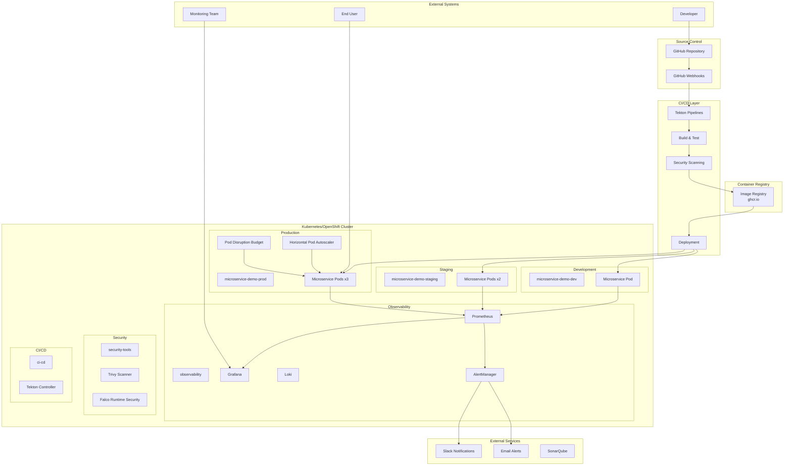
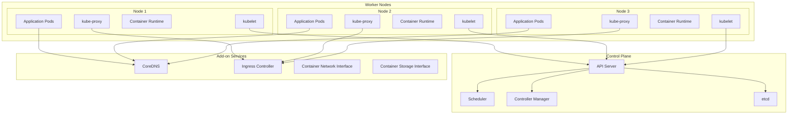
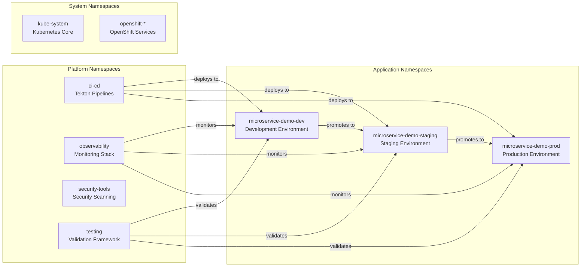
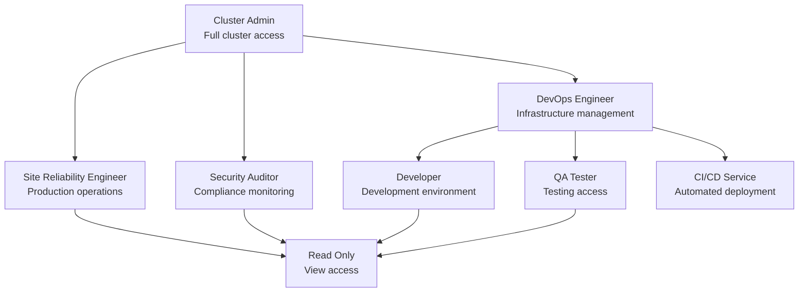
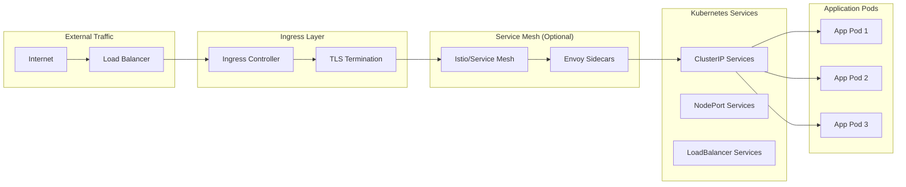
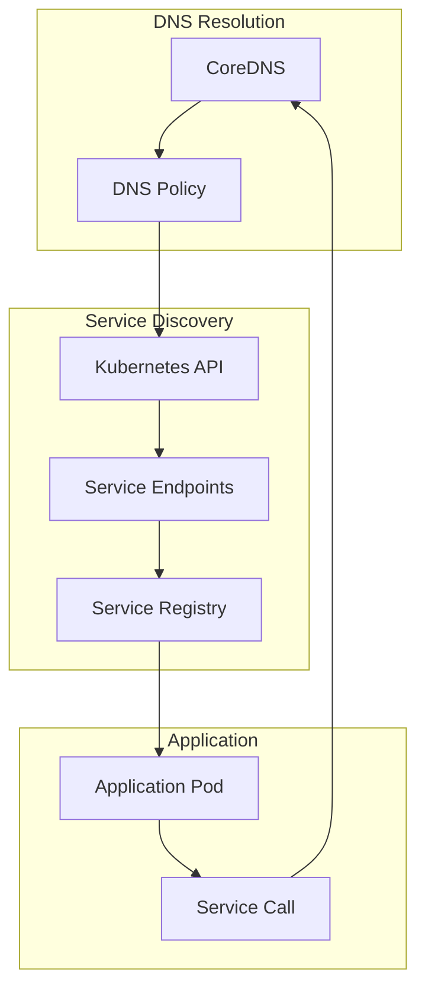
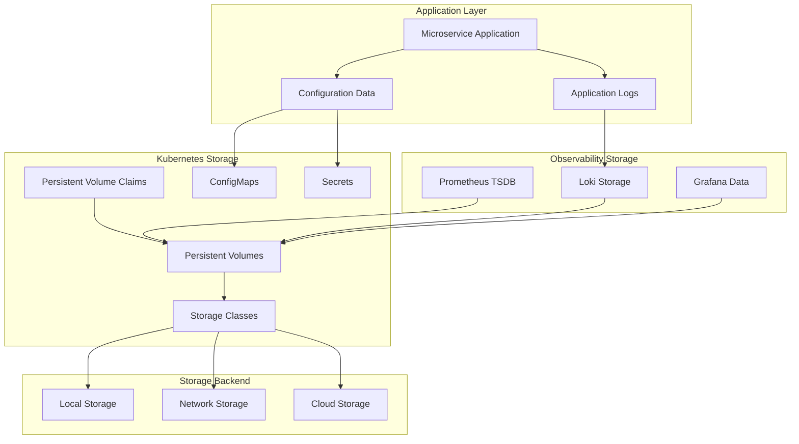
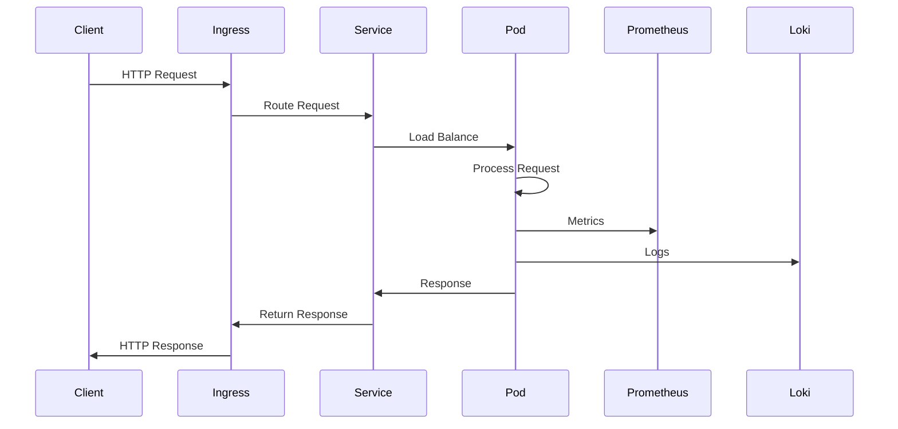
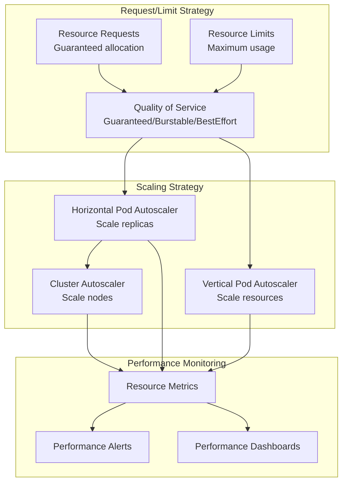

# 🏗️ System Architecture Documentation

This document provides a comprehensive overview of the Enterprise DevOps Pipeline architecture, covering system design, infrastructure patterns, security implementation, and scalability considerations.

## 📋 Table of Contents

- [System Overview](#system-overview)
- [Microservice Architecture](#microservice-architecture)
- [Infrastructure Architecture](#infrastructure-architecture)
- [Security Architecture](#security-architecture)
- [Network Architecture](#network-architecture)
- [Data Architecture](#data-architecture)
- [Scalability Patterns](#scalability-patterns)
- [Performance Considerations](#performance-considerations)

## 🎯 System Overview

### High-Level Architecture



### Core Components

| Component | Purpose | Technology | Scalability |
|-----------|---------|------------|-------------|
| **Microservice** | Core business logic | Python/FastAPI | Horizontal scaling |
| **CI/CD Pipeline** | Automation & deployment | Tekton | Pipeline parallelization |
| **Container Registry** | Image storage | GitHub Container Registry | CDN distribution |
| **Monitoring** | Observability & alerting | Prometheus/Grafana | Federated architecture |
| **Security** | Vulnerability & runtime security | Trivy/Falco | Distributed scanning |
| **Storage** | Persistent data | Kubernetes PV/PVC | Storage classes |

## 🔧 Microservice Architecture

### Application Design

```mermaid
graph TD
    subgraph "FastAPI Application"
        Router[API Router]
        Health[Health Endpoints]
        Business[Business Logic]
        Config[Configuration]
        Logging[Structured Logging]
        Metrics[Prometheus Metrics]
    end
    
    subgraph "External Interfaces"
        HTTP[HTTP/REST API]
        HealthCheck[Health Checks]
        MetricsEndpoint[/metrics]
    end
    
    subgraph "Infrastructure"
        Container[Container Runtime]
        Network[Service Network]
        Storage[Config Storage]
    end
    
    Router --> Health
    Router --> Business
    Business --> Config
    Business --> Logging
    Business --> Metrics
    
    HTTP --> Router
    HealthCheck --> Health
    MetricsEndpoint --> Metrics
    
    Container --> Router
    Network --> HTTP
    Storage --> Config
```

### Key Design Patterns

#### 1. Twelve-Factor App Compliance

- **Codebase**: Single codebase tracked in Git
- **Dependencies**: Explicit dependency declaration
- **Config**: Environment-based configuration
- **Backing Services**: External services as attached resources
- **Build/Release/Run**: Strict separation of stages
- **Processes**: Stateless, shared-nothing processes
- **Port Binding**: Self-contained service export
- **Concurrency**: Horizontal scaling via process model
- **Disposability**: Fast startup and graceful shutdown
- **Dev/Prod Parity**: Environment consistency
- **Logs**: Treat logs as event streams
- **Admin Processes**: One-off admin tasks

#### 2. Health Check Pattern

```python
# Health check implementation
@app.get("/healthz")
async def liveness_probe():
    """Kubernetes liveness probe endpoint"""
    return {"status": "healthy", "timestamp": datetime.now()}

@app.get("/ready")
async def readiness_probe():
    """Kubernetes readiness probe endpoint"""
    # Check dependencies (database, external services)
    return {"status": "ready", "dependencies": "healthy"}
```

#### 3. Observability Pattern

```python
# Metrics instrumentation
from prometheus_client import Counter, Histogram, generate_latest

REQUEST_COUNT = Counter('app_requests_total', 'Total requests', ['method', 'endpoint'])
REQUEST_DURATION = Histogram('app_request_duration_seconds', 'Request duration')

@app.middleware("http")
async def metrics_middleware(request: Request, call_next):
    start_time = time.time()
    response = await call_next(request)
    REQUEST_COUNT.labels(request.method, request.url.path).inc()
    REQUEST_DURATION.observe(time.time() - start_time)
    return response
```

## 🏢 Infrastructure Architecture

### Kubernetes/OpenShift Architecture



### Namespace Architecture



### Resource Management

#### Development Environment
```yaml
resources:
  requests:
    cpu: 100m
    memory: 128Mi
  limits:
    cpu: 500m
    memory: 512Mi
replicas: 1
```

#### Staging Environment
```yaml
resources:
  requests:
    cpu: 200m
    memory: 256Mi
  limits:
    cpu: 1000m
    memory: 1Gi
replicas: 2
```

#### Production Environment
```yaml
resources:
  requests:
    cpu: 500m
    memory: 512Mi
  limits:
    cpu: 2000m
    memory: 2Gi
replicas: 3
hpa:
  minReplicas: 3
  maxReplicas: 10
  targetCPUUtilizationPercentage: 70
```

## 🛡️ Security Architecture

### Zero-Trust Security Model

```mermaid
graph TB
    subgraph "Identity & Access"
        RBAC[Role-Based Access Control]
        SA[Service Accounts]
        Users[User Authentication]
    end
    
    subgraph "Network Security"
        NetworkPol[Network Policies]
        ServiceMesh[Service Mesh<br/>(Optional)]
        TLS[TLS Encryption]
    end
    
    subgraph "Container Security"
        PodSec[Pod Security Standards]
        SecContext[Security Contexts]
        ReadOnlyFS[Read-Only Filesystems]
    end
    
    subgraph "Image Security"
        ImageScan[Image Scanning]
        AdmissionCtrl[Admission Controllers]
        TrustedReg[Trusted Registries]
    end
    
    subgraph "Runtime Security"
        FalcoRules[Falco Runtime Monitoring]
        AuditLogs[Audit Logging]
        Compliance[Compliance Monitoring]
    end
    
    subgraph "Data Security"
        Secrets[Kubernetes Secrets]
        Encryption[Encryption at Rest]
        BackupSec[Backup Security]
    end
    
    RBAC --> NetworkPol
    NetworkPol --> PodSec
    PodSec --> ImageScan
    ImageScan --> FalcoRules
    FalcoRules --> Secrets
```

### RBAC Implementation

#### Role Hierarchy



#### Network Security Policies

```yaml
# Default deny all traffic
apiVersion: networking.k8s.io/v1
kind: NetworkPolicy
metadata:
  name: default-deny-all
spec:
  podSelector: {}
  policyTypes:
  - Ingress
  - Egress
```

```yaml
# Allow specific inter-service communication
apiVersion: networking.k8s.io/v1
kind: NetworkPolicy
metadata:
  name: allow-microservice-to-monitoring
spec:
  podSelector:
    matchLabels:
      app: microservice-demo
  policyTypes:
  - Egress
  egress:
  - to:
    - namespaceSelector:
        matchLabels:
          name: observability
    ports:
    - protocol: TCP
      port: 9090  # Prometheus
```

## 🌐 Network Architecture

### Service Communication



### DNS and Service Discovery



## 💾 Data Architecture

### Storage Architecture



### Data Flow



## 📈 Scalability Patterns

### Horizontal Scaling

#### Pod-Level Scaling
```yaml
apiVersion: autoscaling/v2
kind: HorizontalPodAutoscaler
metadata:
  name: microservice-hpa
spec:
  scaleTargetRef:
    apiVersion: apps/v1
    kind: Deployment
    name: microservice-demo
  minReplicas: 3
  maxReplicas: 10
  metrics:
  - type: Resource
    resource:
      name: cpu
      target:
        type: Utilization
        averageUtilization: 70
  - type: Resource
    resource:
      name: memory
      target:
        type: Utilization
        averageUtilization: 80
```

#### Cluster-Level Scaling
```yaml
apiVersion: autoscaling.k8s.io/v1
kind: VerticalPodAutoscaler
metadata:
  name: microservice-vpa
spec:
  targetRef:
    apiVersion: apps/v1
    kind: Deployment
    name: microservice-demo
  updatePolicy:
    updateMode: "Auto"
  resourcePolicy:
    containerPolicies:
    - containerName: microservice
      maxAllowed:
        cpu: 2000m
        memory: 2Gi
      minAllowed:
        cpu: 100m
        memory: 128Mi
```

### Performance Optimization

#### Resource Allocation Strategy



## 🔧 Performance Considerations

### Application Performance

#### Response Time Optimization
- **Target Response Time**: < 200ms for 95th percentile
- **Database Connection Pooling**: Async connection management
- **Caching Strategy**: Redis integration for frequently accessed data
- **Resource Optimization**: JIT compilation and memory management

#### Throughput Optimization
- **Concurrent Processing**: Async/await patterns
- **Load Balancing**: Round-robin with health checks
- **Resource Allocation**: Proper CPU/memory sizing
- **Network Optimization**: Keep-alive connections

### Infrastructure Performance

#### Container Optimization
```dockerfile
# Multi-stage build for smaller images
FROM python:3.11-slim as builder
WORKDIR /build
COPY requirements.txt .
RUN pip install --user -r requirements.txt

FROM python:3.11-slim
WORKDIR /app
COPY --from=builder /root/.local /root/.local
COPY app/ .
ENV PATH=/root/.local/bin:$PATH
USER 1000
EXPOSE 8080
CMD ["python", "main.py"]
```

#### Network Performance
- **Service Mesh**: Optional Istio for advanced traffic management
- **DNS Optimization**: CoreDNS caching and performance tuning
- **Network Policies**: Efficient traffic filtering
- **Load Balancing**: Session affinity and health checks

### Monitoring Performance

#### Metrics Collection
```yaml
# ServiceMonitor for efficient metrics collection
apiVersion: monitoring.coreos.com/v1
kind: ServiceMonitor
metadata:
  name: microservice-metrics
spec:
  selector:
    matchLabels:
      app: microservice-demo
  endpoints:
  - port: http
    path: /metrics
    interval: 30s
    scrapeTimeout: 10s
```

#### Dashboard Performance
- **Grafana Optimization**: Efficient queries and caching
- **Prometheus Optimization**: Recording rules and retention policies
- **Alert Optimization**: Intelligent grouping and throttling

## 🔄 Architecture Evolution

### Current State (v1.0)
- ✅ Single microservice with FastAPI
- ✅ Kubernetes-native deployment
- ✅ Basic observability stack
- ✅ Security fundamentals

### Near-term Enhancements (v1.1-1.2)
- 🔄 Database integration (PostgreSQL)
- 🔄 Caching layer (Redis)
- 🔄 Message queue integration (RabbitMQ/Apache Kafka)
- 🔄 Service mesh implementation (Istio)

### Long-term Vision (v2.0+)
- 🔮 Multi-microservice architecture
- 🔮 Event-driven architecture
- 🔮 Cross-region deployment
- 🔮 Advanced AI/ML integration

---

**📚 Related Documentation**
- [Deployment Guide](../deployment/README.md)
- [Security Documentation](../security/README.md)
- [Operations Manual](../operations/README.md)
- [API Reference](../api/README.md)

This architecture document serves as the foundation for understanding the system design and implementation patterns used throughout the DevOps pipeline. 